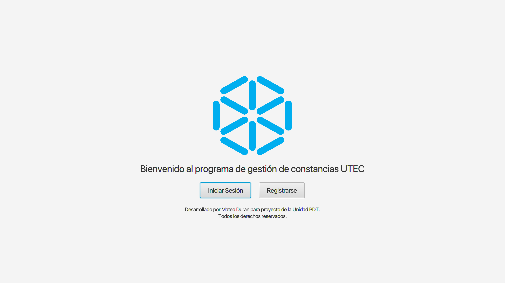
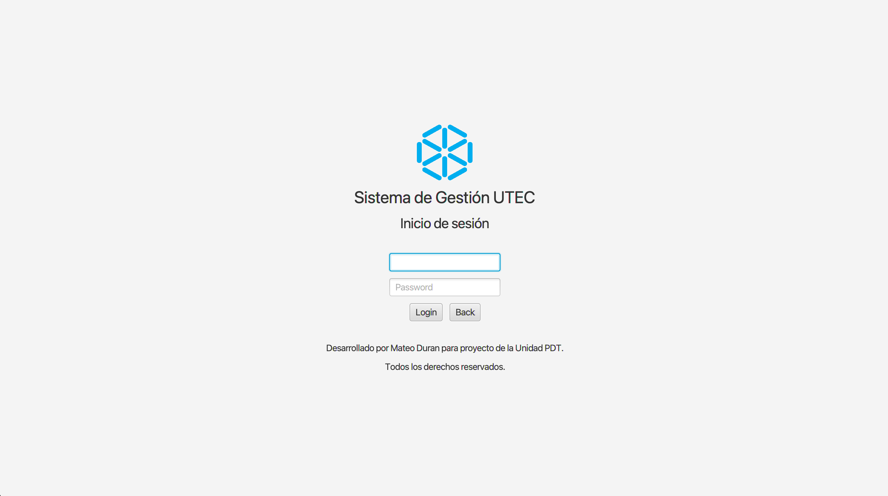
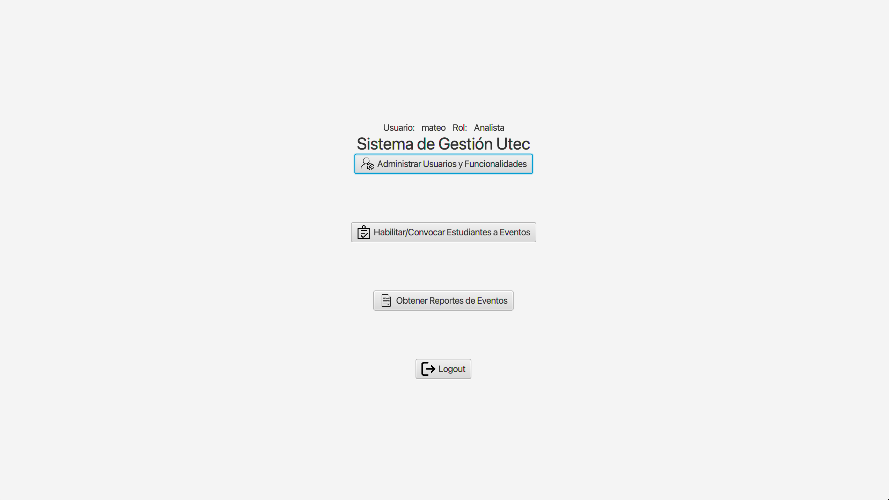
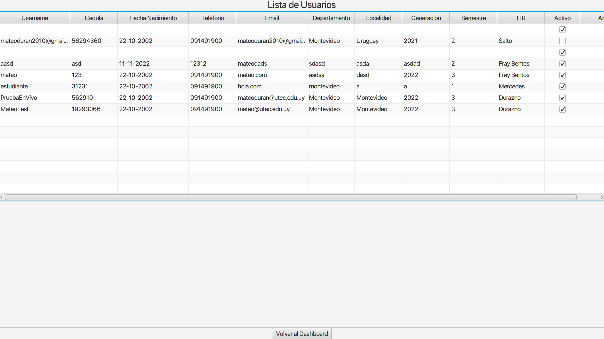

# Application Overview

## Purpose

The application is designed to manage certificates of assistance of given university events. It provides
This application leverages modern technologies to
deliver a seamless user experience.

## Technologies Used

- JavaFX: JavaFX is used for building the user interface, offering
  a rich set of UI controls and a highly customizable look and feel.

- Spring Boot: The application uses Spring Boot for creating a
  robust backend. Spring Boot simplifies the development of
  Java-based applications by providing built-in functionalities
  such as dependency injection, aspect-oriented programming, and more.

## Setup Instructions

### JavaFX Setup

To set up the development environment, JavaFX version 17 is required.
You can download the JavaFX SDK version 17.0.11 from the following link:
[Gluon JavaFX](https://gluonhq.com/products/javafx/).

Steps:

1. Download JavaFX: Download the appropriate version for your operating
   system from the link provided above.

2. Set JavaFX Path: Once downloaded, locate the path to the JavaFX SDK
   and add it to your pom.xml file:
```
<path.to.javafx>/usr/local/javafx-sdk-17.0.11/lib</path.to.javafx>
```
   Replace `/usr/local/javafx-sdk-17.0.11/lib` with the actual path on
   your system.

## Database Setup

Before running the application, ensure the database instance is up and
running. Use Docker Compose to start the database services.

### Steps:

1. Open a terminal or command prompt.

2. Navigate to the directory containing your docker-compose.yml file.

3. Run the following command to start the database:

   docker-compose up

### Running the Application

Once the database is running, execute the following command to run
the application:
```
java -jar your-application.jar
```
Replace `your-application.jar` with the actual name of the jar file.

## Application Images

Below are some images of the application, showcasing its interface
and functionalities.

#### Main Menu



Description: This image shows the main dashboard of the application,
where users can log in if they have an account or register.

#### Login screen



Description: This image illustrates the login screen, where users enter their credentials.

#### Dashboard



Description: Once the users login, they are directed to the dashboard,
where they can access various features and functionalities limited by their role.

#### List Users



Description: The users with the admin role can view and manage other users in the system.
